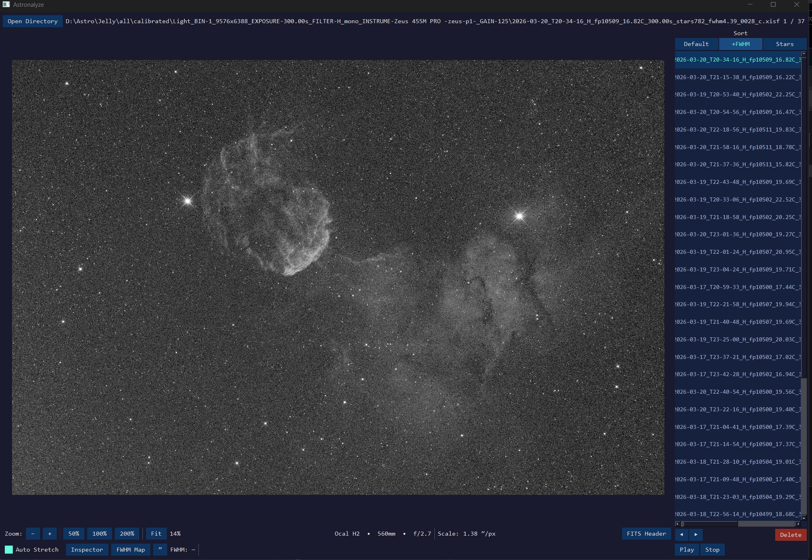
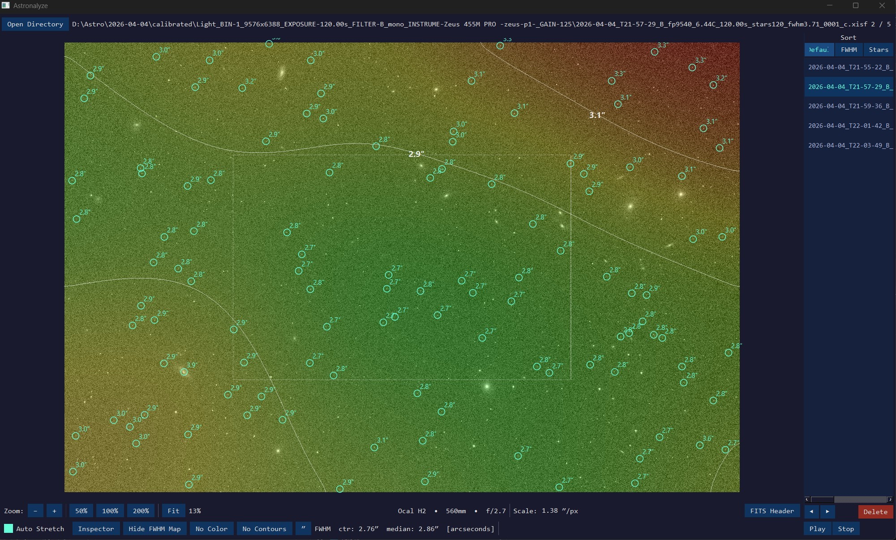
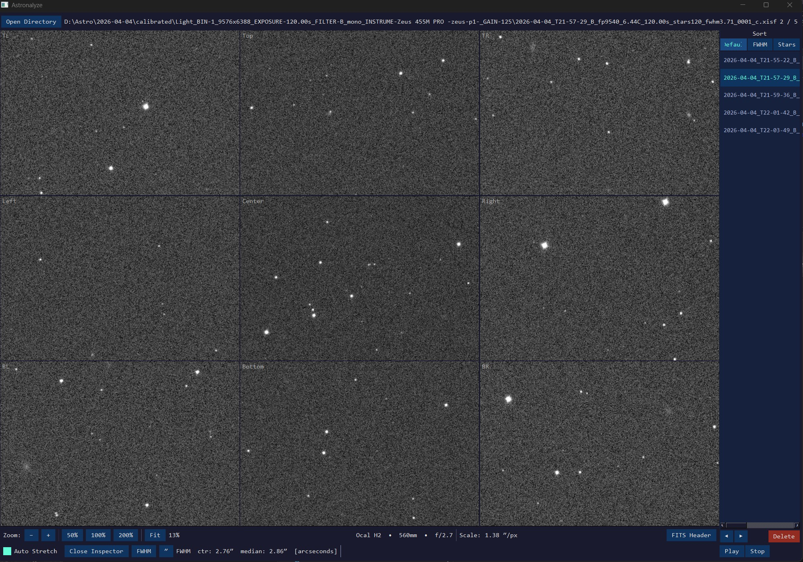

Please see the Astronalyze_User_Guide.md for a complete guide to using this tool

To install, download Astronalyze.zip from the release folder below to a folder on your hard drive.  Right-click and select Extract All...

https://github.com/ricksastro/Astronalyze/releases/tag/v1.0.0

This will create an Astronalyze folder with Astronalyze.exe in it as well as other support files.   No need to install anything!

You can run Astronalyze.exe by double clicking on it.  Note that the first time you run it, it may take several seconds to come up.
Open a directory containing FITS or Pixinsight XISF image files and the directory list on the right will populate and the top file will be displayed.
From there, soo the users guide for all the options, or just click around and try it.

Note, the sort FWHM and Stars rely on a specific naming convention in the file name.  I have NINA embed them in my names (..._fwhm4.5_... and ..._stars456_...).   
This isn't required to use the tool, but it makes sorting instant and convenient.

If you find it convenient to use, you can register FITS and XISF with this tool so you can double click on any of those image files and it will display it and load the other images in that directory.  
Again, this isn't required, but it's great to monitor how things are going during an imaging session.

